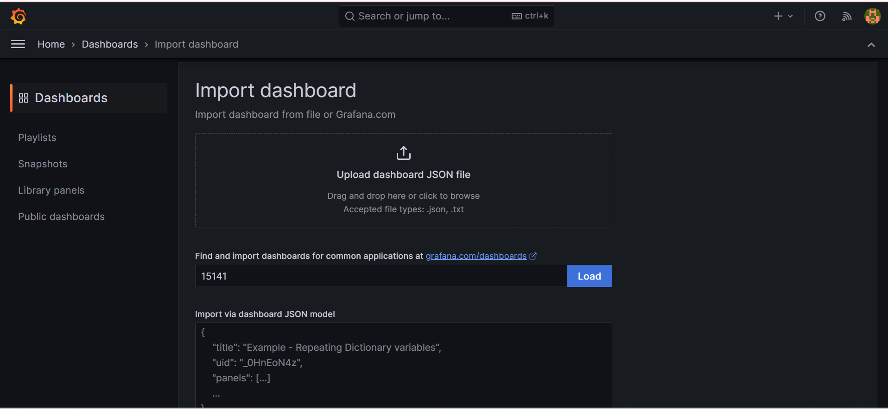

# SETTING UP LOGGING ON EKS CLUSTER USING THE LOKI-PROMTAIL-GRAFANA STACK.

Hello readers, welcome to my page. This project describes a complete setup of logging for your application deployed on EKS cluster. It provides you with a pre-designed dashboard using the Loki-Promtail-Grafana stack. 

Promtail scrape the logs using a pull mechanism from your kubernetes cluster and Loki stores and indexes the logs more efficiently and  Grafana visualizes them for analysis and monitoring. 

### Prerequisites

Before you begin, ensure you have the following prerequisites in place:

1.  EKS cluster running in a VPC
2.  Application already deployed in the EKS Cluster. (we arer only testing logs and not focusing on deployment)
3.  Helm installed. Helm can be installed by visiting the [helm offical documentation](https://helm.sh/docs/intro/install/)

Confirm helm installation 

```
helm version
```
# Install Loki, Grafana and Promtail

```
helm repo add grafana https://grafana.github.io/helm-charts
helm repo update
```
Change to the helm directory
# Set up values file for loki

```
vi loki.yml
```
Paste the below

```
loki:
  enabled: true

promtail:
  enabled: true

grafana:
  enabled: true
  service:
    type: LoadBalancer
```

Install the stack using helm 

```
helm install loki grafana/loki-stack --values loki.yml
```
The above is created in a default namespace. 

get the load balancer dns by running the command kubectl get svc and copy the load balancer for Loki-Grafana service

```
kubectl get svc 
```

# Get Admin Password

```
kubectl get secret --namespace default loki-grafana -o jsonpath="{.data.admin-password}" | base64 --decode ; echo
```

# Create dashboard with the ID 

Select dashboard
Click on new
Click import
Add the dashboard ID

```
15141
```


Select Loki Default as the data source. Then click on Load to load the new dashboard



You can set the desired namespace and select the service type you want to view the logging. 


# Happy Logging!
